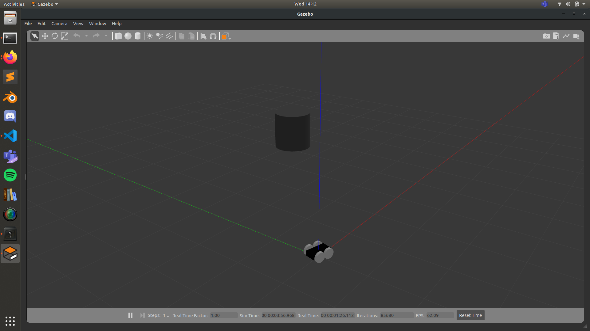
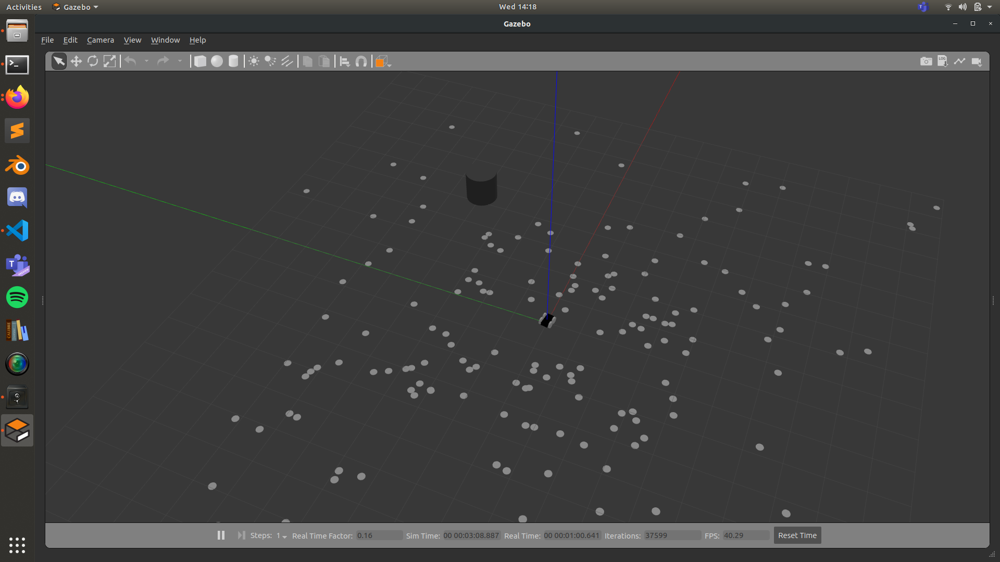
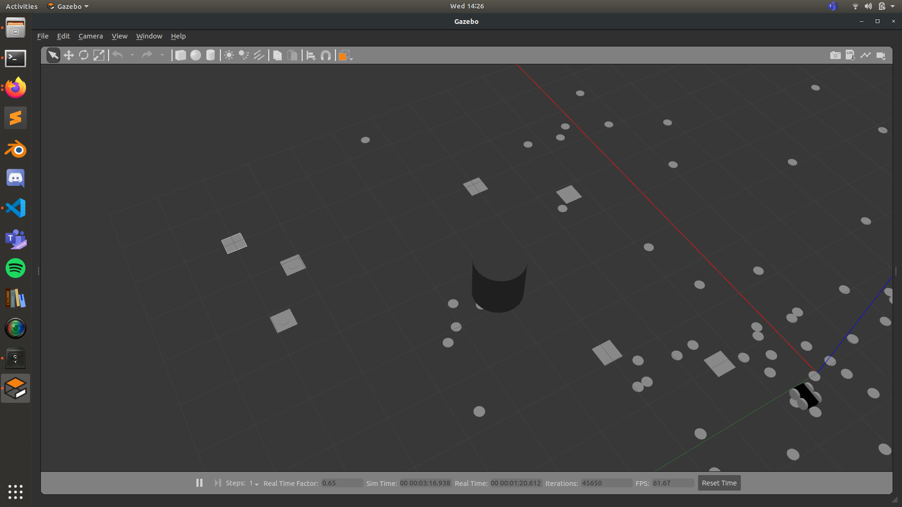
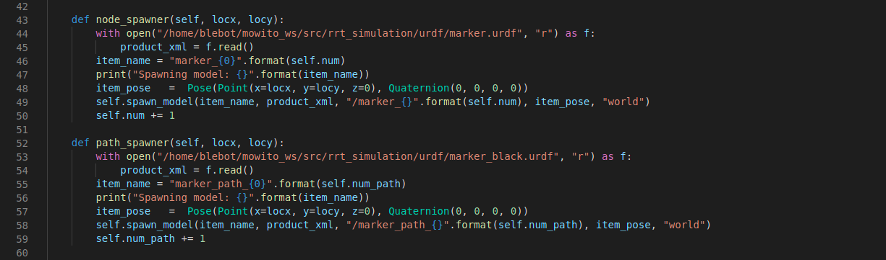

# Rapidly Exploring Random Tree

Implementation of RRT global planner using ROS framework and simulated on Gazebo
--
# RRT Algorithm

RRT is a global path planning algorithm which is used to efficiently search higher dimensional spaces. The algorithm is sampling (graph) based. 

In the X-Y plane, we have a two nodes, the start node and the end node which is our goal. Then we randomly generate a new node in the plane and check if the node is colliding with any of the already known obstacles. Once that is done, we connect the new node with its nearest node and add it to our node list. After a certain amount of sampling, we move towards the goal and then our sampling stops and we generate the final path.


# Implementation

To develop this algorithm I chose ROS as my initial framework due to its flexibility with Multiple programming languages and easier communication between multiple nodes. 

I created a 4 wheel bots URDF model and added a driving plugin to it. Then I created a simple world with an obstacle in the middle.




To view the world, navigate to the world folder in rrt_simulation directory and type this:

```
gazebo obstacle_world.world 
```

Then I created two different URDF models and used the spawn service in Gazebo to deploy these models as nodes of the RRT. The cylindrical nodes were the random nodes and could be placed anywhere and even on the obstacle but the final path wouldn't be affected by it.



* All the XACRO files have been developed and edited by hand and the URDFs are generated from these XACROs itself.

The Final Waypoints have been spawned with a square Marker. 



* The obstacle has been avoided as shown above by the waypoints

A Final Video of the whole run can be seen in the readme_assets in the src folder.

# How to Run

Clone the repo inside a catkin workspace and type:

```
catkin_make

source devel/setup.bash
```
This would setup the whole directory. You can also add the source line in your .bashrc if you don't want to repeat this process.

Now Navigate to the rrt_bot_optimised.py and change the path of the URDFs to the path in your workspace.
These URDFs need an absolute path so please change it accordingly.



* Line 44 and Line 53

After that is done, your setup is complete. To run the algorithm just type:

```
roslaunch rrt_simulation rrt_bot.launch
```
in your terminal

# Changing the Algorithm Parameters

Most of the parameters of the algorithm cannot be changed however a new goal could be set as well as new obstacles.

In line 232 of the rrt_bot_optimised.py, change end_point to fix new goal and change the obstacle_loc list to add more obstacles.
```
obj = RRT_Planner(goal_prob= 0, min_dis= -10, max_dis=10, 

obstacle_loc=obstacle_loc, start_point=[0, 0], end_point= [8, 8], length= 2.

, goal_radius=2)

```
# Changes that I am working on

* Implementing the algorithm in C++ to improve the efficiency of the Planner
* Writing Comments on the python code to make it more understandable


# Improvements that could be made

* Implementing RRT*
* Adding a Local Planner
* Realtime Mapping the environment


